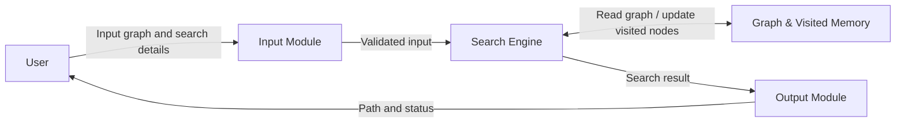
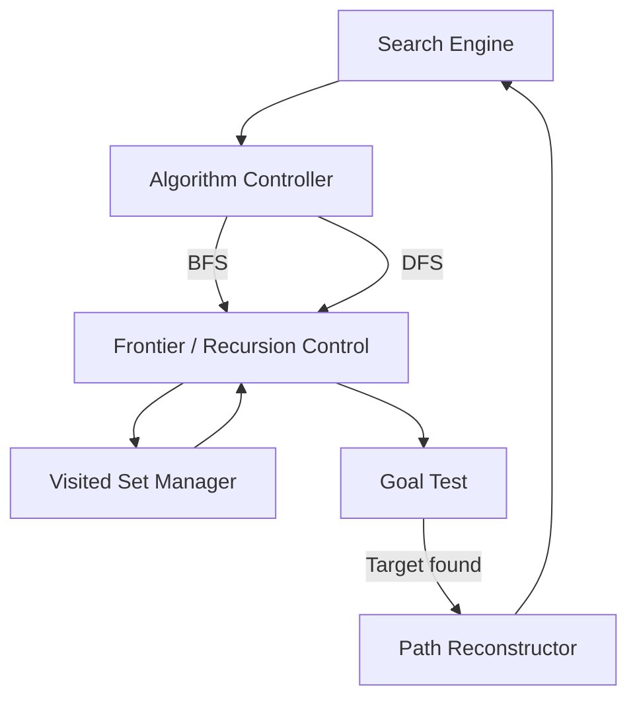
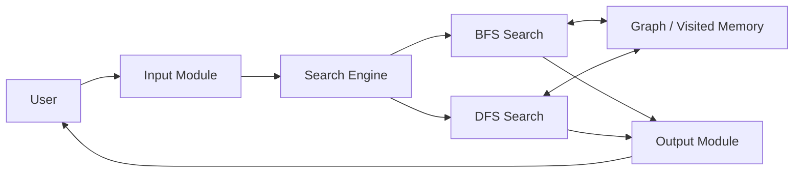

# SLE-3: Full C4 Architecture – Graph Search System

## Course

**02AML204 – Introduction to Artificial Intelligence**  
**System:** Graph Search System using BFS and DFS  
**SLE:** 3 – Architectural Design using Full C4 Model

---

## 1. System Title & Short Description

The **Graph Search System** is a simple search system that finds a path between a starting node and a target node in a graph. It supports two search strategies: **Breadth-First Search (BFS)** and **Depth-First Search (DFS)**. The user provides or selects the graph, starting node, target node and search method. The Search Engine explores the graph while maintaining visited information and finally displays the path and search result.

This system is continued from the graph-search work used in SLE-2.

---

# 2. C4 Level 1 – Context Diagram

### Purpose

The Context diagram shows the complete system as one main box and the external user interacting with it.


### Explanation

The user provides the graph-search input and selects BFS or DFS. The Graph Search System processes the request and returns the discovered path, search status and related result information. The user is the only external actor required for this simple system.

---

# 3. C4 Level 2 – Container Diagram

### Main Containers

The architecture is divided into four main containers so that the system remains simple and readable.



### Container Responsibilities

| Container | Responsibility |
|---|---|
| **Input Module** | Accepts the graph, starting node, target node and selected search method. |
| **Search Engine** | Runs BFS or DFS and controls the search process. |
| **Graph & Visited Memory** | Stores graph relationships and visited-node information used during traversal. |
| **Output Module** | Formats and displays the path, search status and explored-node information. |

### Why these containers?

The SLE-3 guideline recommends keeping the container diagram to about 4–7 boxes. This design uses four clear containers and separates input, processing, memory and output responsibilities.

---

# 4. C4 Level 3 – Component Diagram

The **Search Engine** is selected as the main container because it contains the core search logic.



## Component Responsibilities

| Component | Responsibility |
|---|---|
| **Algorithm Controller** | Selects and starts BFS or DFS according to the user's choice. |
| **Frontier / Recursion Control** | Manages the next nodes to explore; BFS uses a queue while DFS uses recursive depth-first traversal. |
| **Visited Set Manager** | Records visited nodes and prevents unnecessary repeated exploration. |
| **Goal Test** | Checks whether the current node is the target node. |
| **Path Reconstructor** | Produces the final path from the search result. |

> Note: The Component diagram intentionally covers only the Search Engine, as required by the SLE-3 guideline.

---

# 5. C4 Level 4 – Code Level Overview

The Code level shows only the important classes/functions and their responsibilities. Large source-code blocks are not included.

### BFS

- `GRAPH` – stores the graph as an adjacency structure.
- `bfs_search(graph, start, target)` – performs Breadth-First Search.
- `measure_bfs(target, runs)` – measures repeated BFS execution time.
- `print_result(case_name, target)` – displays BFS result and timing information.

### DFS

- `GRAPH` – stores the graph as an adjacency structure.
- `dfs_search(graph, node, target, visited, path)` – performs recursive Depth-First Search.
- `measure_dfs(target, runs)` – measures repeated DFS execution time.
- `print_result(case_name, target)` – displays DFS result and timing information.

### Conceptual Code Structure

```text
Graph Data
   |
   +--> BFS: bfs_search()
   |       |
   |       +--> Queue + Visited Set
   |
   +--> DFS: dfs_search()
           |
           +--> Recursion + Visited Set
```

---

# 6. Overall Architecture Flow



The overall flow is: **User Input → Input Module → Search Engine → BFS/DFS → Graph & Visited Memory → Output Module → User**.

---

# 7. Design Decisions

1. **One Search Engine:** BFS and DFS are placed inside one Search Engine because both solve the same graph-search problem.
2. **Separate Input and Output:** Input and output responsibilities are separated from the search algorithm to keep the design easy to understand and modify.
3. **Visited Information:** A visited set is treated as an important memory responsibility because both BFS and DFS use it to avoid repeated traversal.
4. **Single Component View:** Only the Search Engine is decomposed into components, keeping the architecture within the required scope.

---

# 8. AI Contribution Note

**AI tools used:** ChatGPT  

**What AI helped with:** Organizing the SLE-3 architecture according to the Full C4 Model, preparing concise explanations, structuring the Markdown documentation and creating Mermaid diagram descriptions.

**What the student did:** Selected the graph-search system from the previous SLE work, reviewed the architecture, checked the BFS/DFS responsibilities, and is responsible for understanding and explaining the final design.

---

# 9. Conclusion

The Full C4 Model provides a clear way to represent the Graph Search System at four levels: Context, Container, Component and Code. The design separates user interaction, input handling, search processing, memory and output. The architecture also makes the roles of BFS and DFS clear while keeping the system small enough to explain easily during SLE-3 evaluation.

---

## 10. SLE-3 Checklist

- [x] Level 1 – Context Diagram
- [x] Level 2 – Container Diagram
- [x] Level 3 – Component Diagram for one main container
- [x] Level 4 – Code Level Overview
- [x] Design Decisions
- [x] AI Contribution Note
- [x] Conclusion
- [x] Clear and simple architecture
